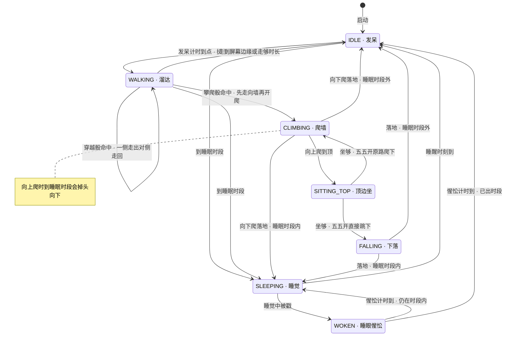

# 小凉代码走读课（精简版：架构 + 状态机核心）

> 基于 **v0.4.2**（commit `1c64813`）· 2026-09-29 生成
> 适合对照源码阅读；行号随版本可能漂移，以符号名（函数/变量名）定位为准。
> 标注约定：**「设计决策」**= 为什么这么做，**「坑」**= 踩过或易踩，**「可测试性」**= 怎么测到的。

## 目录

- **第 0 讲 · 架构总览**：0.1 三层模块地图 / 0.2 main.py 装配链 / 0.3 三条数据流线 /
  0.4 铁律：纯逻辑与 GUI 分离 / 0.5 三个装配细节 / 0.6 小结
- **第 1 讲 · 状态机**：1.1 定位与契约 / 1.2 十一个状态 / 1.3 tick 五步管线 /
  1.4 事件 API 契约 / 1.5 poke 三态 / 1.6 回退机制 / 1.7 攀爬线 / 1.8 穿越 /
  1.9 拖拽两层配合 / 1.10 怎么测 / 1.11 小结
- **附录**：未选讲模块速览

---

# 第 0 讲 · 架构总览：小凉是怎么搭起来的

读完本讲你应该能回答：项目分几层、每层谁认识谁、数据往哪个方向流、
为什么 167 项测试能全绿且几秒跑完。

## 0.1 三层模块地图

整个项目约 2000 行源码 + 1369 行测试。按「是否碰 Qt」分成三层，**依赖永远单向向下**：

```
┌─────────────────────────────────────────────────────────┐
│ 装配层    main.py (151 行)                               │
│           组装所有零件、接线、容错，进入 Qt 事件循环        │
├─────────────────────────────────────────────────────────┤
│ GUI 层    pet_window.py (362)  渲染+鼠标 → 「身体」       │
│ (碰 Qt)   bubble.py     (139)  语音气泡                   │
│           sprite.py     (103)  素材加载/帧动画            │
│           sound.py      (96)   音效池+TTS                │
│           tray.py       (83)   系统托盘                   │
├─────────────────────────────────────────────────────────┤
│ 纯逻辑层  state_machine.py (521)  行为状态机 → 「大脑」    │
│ (零 Qt)   config.py       (164)  配置读写+迁移            │
│           reminder.py     (124)  久坐/整点判定            │
│           status.py       (114)  心情/饱腹数值            │
│           autostart.py    (52)   开机自启注册表           │
└─────────────────────────────────────────────────────────┘
              （行数为非空行，看比例即可）
```

> [!NOTE]
> **设计决策**：关键观察——**最大的文件是 state_machine.py，而不是任何 GUI 文件**。
> 这个项目刻意把复杂度压进纯逻辑层：复杂但可测，好过简单但只能靠肉眼验收。
> GUI 层每个文件都很薄，只干「翻译」：把状态机的数字翻译成像素和声音，
> 把鼠标事件翻译成状态机 API 调用。

## 0.2 main.py 的装配链

`main()`（main.py:51 起）的组装顺序就是依赖顺序，每个零件只依赖它前面出现过的东西：

```
logging → QApplication → cfg(load_config)
  → status(PetStatus.load)        # 数值先于状态机
  → sprites(SpriteManager)        # 素材失败 = 弹框退出（唯一致命项）
  → machine(PetStateMachine)      # 注入 status 与 cfg 各参数
  → sound(SoundEngine)            # 注入 cfg["sound"]（活字典，见 0.5）
  → window(PetWindow)             # 注入 machine / sprites / sound
  → bubble(BubbleWidget)          # 锚点 = window.frameGeometry
  → tray(PetTray)                 # 注入 machine / 图标 / cfg
  → reminders(ReminderService)    # 注入 logic 与 on_reminder 回调
  → save_timer + aboutToQuit      # 双保险落盘
  → app.exec()                    # 进入事件循环，此函数不再返回
```

注意：`main.py` 里**没有定义任何业务行为**，只做三件事——装配、接线（lambda 回调）、
容错。这就是 composition root（组装根）模式：全程序只有这一个地方知道「全部零件」。
想知道「小凉为什么这么做」永远去纯逻辑层找；想知道「谁跟谁接上了」才看 main.py。

## 0.3 三条数据流线

**① 心跳线（30 fps，程序的主脉搏）**

```
QTimer(33ms) ──→ _on_tick()                 pet_window.py:136,184
   dt = clock.restart()/1000    ← 真实经过时间，不是固定步长
   machine.tick(dt)             ★ 纯逻辑推进：状态/坐标/数值全在这一步变
   sprites.get_frame(action,…)  状态 → 像素帧（含镜像/倒放）
   self.move(…)                 逻辑坐标 → 屏幕坐标
   self.update()                触发重绘
```

分工：`machine.tick(dt)` 里不发生任何 Qt 调用，只更新 `x, y, state, status` 这些数字；
把数字变成窗口位置和图片是 `_on_tick` 后半段的事。「大脑想、身体动」的单向数据流。

**② 事件线（外界 → 状态机）**

```
鼠标按下/移动/松开 → pet_window 判定戳还是拖 → machine.poke() / drag_*()
托盘 / 右键菜单    → machine.set_paused() / feed()
ReminderService    → on_reminder(kind, text)      main.py:151
                     ├─ machine.remind()   动画可能被拒（睡觉/在墙上）
                     ├─ sound.speak(text)  语音照念
                     └─ bubble.say(text)   气泡照弹
```

> [!NOTE]
> **设计决策**：`on_reminder`（main.py:151）**故意不看 `machine.remind()` 的返回值**——
> 动画拒播拉倒，语音和气泡照常。规格原文：「提醒的使命是传达信息，动画只是锦上添花」。
> 走读时这类「故意不检查返回值」的地方最值得停下来问为什么。

**③ 持久化线（状态 → 磁盘）**

```
status.json ← save_status()（main.py:64，三个触发点汇到同一入口）
   ① on_status_change    戳/喂食数值变化的瞬间（state_machine.py:297）
   ② save_timer 每 60s   覆盖「只有时间衰减」的场景
   ③ app.aboutToQuit     退出兜底
config.json ← save_cfg()（main.py:127）托盘勾静音/自启时就地写回
```

## 0.4 铁律：纯逻辑与 GUI 分离 + 依赖注入

`state_machine.py:1` 第一行就声明了契约：**「宠物行为状态机：纯逻辑，不依赖 Qt，
可单元测试。」**这不是口号——整个文件没有一行 `import PySide6`，唯一的「外界」是
`random`、`datetime` 和同层的 `status`。它靠构造函数上的四个注入点做到：

```python
# state_machine.py:77-98 · 构造函数签名（节选）
def __init__(self, bounds, pet_width, pet_height, *,
             walk_speed=60.0, …,
             rng: random.Random | None = None,   # ← 随机数可注入
             status: PetStatus | None = None,    # ← 数值系统可注入
             clock=None,                         # ← 时间可注入
             on_status_change=None):             # ← 落盘回调可注入
```

| 注入点 | 生产环境 | 测试环境 | 换来的能力 |
|--------|---------|---------|-----------|
| `rng` | `random.Random()` | 固定种子 `Random(7)` | 「50% 跳下/爬下」这类随机分支**确定性复现** |
| `clock` | `datetime.now().time()` | 假时钟返回指定时刻 | 跨午夜睡眠时段不用等到半夜就能测 |
| `status` | 真实 PetStatus | 预置 `mood=100` | 「满格戳不加心情」直接构造 |
| `on_status_change` | `save_status` | 记录调用的 list | 验证「数值真变了才落盘」 |

于是测试可以这么写（真实用例）：

```python
# tests/test_pet_window.py:59-61 · 一行钉死一个随机分支
machine._timer = 0.12            # 坐几帧就跳
machine._rng = random.Random(2)  # random()=0.956 ≥0.5 → 必走「跳下」分支
```

> [!TIP]
> **可测试性**：没有 sleep、没有 mock 库、没有「多跑几次总有一次过」的 flaky 测试。
> 167 项测试全绿且 offscreen 几秒跑完，根子就在依赖注入。GUI 侧同理：`PetWindow`
> 接受 `sound=None`、`on_poke_hint=None`（pet_window.py:83）——不注入就是安静无副作用
> 的裸窗口，注入假对象就能验证反馈分流。**可注入 = 可测试 = 可信任。**

## 0.5 三个装配细节（真实用过的技巧与坑）

**① 迟绑定 lambda（main.py:113-125）**

```python
window = PetWindow(…, on_quit=app.quit, sound=sound,
                   # 迟绑定：bubble 在下方创建，戳触发回调时才解析
                   on_poke_hint=lambda result: bubble.say(
                       POKE_HINTS.get(result, "")))
window.show()
bubble = BubbleWidget(anchor=window.frameGeometry)  # ← 这时才存在
```

> [!WARNING]
> **坑**：看起来像 NameError，其实没问题——Python 闭包捕获的是**变量名**不是值，
> lambda 体在「戳触发时」才执行，那时 `bubble` 早已赋值。但前提是没有人在
> `bubble = …` 之前戳小凉：**装配顺序敏感**。同类技巧：`anchor=window.frameGeometry`
> 传的是绑定方法本身（不带括号），气泡每次要位置时现调，天然跟随窗口移动。

**② 共享活字典（main.py:110 / 161）**

```python
sound = SoundEngine(cfg["sound"], …)     # 传引用，不是拷贝
…
# on_reminder 内：
if cfg["sound"].get(category, True):     # 托盘改了勾选，这里现读即生效
    bubble.say(text)
```

托盘、SoundEngine、on_reminder 三方拿的是**同一个 dict 对象**。托盘勾一下「静音」，
声音引擎和气泡闸门立刻知道——不需要任何事件广播机制。代价是隐式耦合（谁都能改它）；
小项目里这笔交易划算，大项目要换成正经的配置服务。

**③ 容错分级：哪些错误忍、哪些错误死**

| 故障 | 处理 | 为什么配得上这个待遇 |
|------|------|---------------------|
| config.json 写不进（只读目录） | 记日志，用内存默认值继续（main.py:74-78） | 配置是锦上添花 |
| status.json 损坏 | load 内部回退默认 80/80 | 数值丢了不该挡启动 |
| 运行时保存失败 | 记日志不崩（main.py:133-136） | 写不进盘 ≠ 桌宠该死 |
| **素材加载失败** | **弹框 + return 1 退出**（main.py:89-94） | 没素材 = 看不见 = 程序无意义 |
| 声音后端初始化失败 | 降级静默 | 聋了还能看 |

> [!NOTE]
> **设计决策**：一个桌面宠物的生死标准很清晰——**只有「渲染不出来」才配得上崩溃**，
> 其余一律降级。这张分级表本身就是需求文档。

## 0.6 第 0 讲 · 30 秒小结

1. **三层**：装配（main）/ GUI（薄适配）/ 纯逻辑（厚核心），依赖永远单向向下。
2. **三条数据流**：心跳（tick→渲染）、事件（鼠标/托盘/提醒→状态机 API）、
   持久化（三触发点→一个 save）。
3. **一条铁律**：状态机零 Qt，一切外界（随机、时间、数值、落盘）走构造注入——
   这是 167 项测试的物理基础。

---

# 第 1 讲 · 状态机 state_machine.py：521 行的心脏

读完本讲你应该能回答：11 个状态怎么分组、tick 每帧做什么、事件 API 的受理/拒绝
契约是什么、反应态怎么精确回退、以及本周验证过的两个功能（戳冷却反馈、延迟提交
拖拽）在状态机这端长什么样。

## 1.1 定位与契约

先立四条「地基约定」，后面所有代码都建立在它们之上：

| 约定 | 内容 | 位置 |
|------|------|------|
| 零 Qt 契约 | 「纯逻辑，不依赖 Qt，可单元测试」——模块第一行 | state_machine.py:1 |
| 坐标约定 | `(x, y)` = 角色包围盒**左上角**，逻辑像素，原点 = 工作区左上角（任务栏在顶/左时由 GUI 层的 origin 平移补偿） | state_machine.py:3 |
| 地面定义 | `floor_y` 属性 = `bounds.height - pet_height`，一切「落地」都以它为准 | state_machine.py:161-164 |
| 贴边阈值 | `EDGE_CLIMB_ZONE_RATIO = 0.25`：松手点距屏幕缘 ≤ 25% 身宽 = 贴边。用比例而非绝对像素，素材缩放时自适应 | state_machine.py:30-32 |

文件里还有两个模块级纯函数值得注意：`parse_hhmm`（"23:00" → 分钟数）和
`in_sleep_window_minutes`（跨午夜时段判定，state_machine.py:62-73）。它们被单独提到
类外，就是因为「跨午夜窗口」这种边界逻辑必须能脱离状态机独立测：`23:00→07:00`
拆成 `[start,24:00) ∪ [0:00,end)`，start==end 视为空窗口永不睡。

## 1.2 十一个状态一览

```python
# state_machine.py:35-46 · State 枚举
class State(Enum):
    IDLE = auto()
    WALKING = auto()
    DRAGGED = auto()
    FALLING = auto()
    POKE_REACT = auto()    # 被戳：原地反应，播完回原状态
    EATING = auto()        # 进食：吃完按时段回清醒/睡觉
    SLEEPING = auto()      # 睡眠时段内睡觉
    WOKEN = auto()         # 睡觉被戳醒：惺忪几秒后回睡或起床
    CLIMBING = auto()      # 贴侧壁攀爬（climb_direction 区分上/下）
    SITTING_TOP = auto()   # 顶边坐着晃腿发呆
    REMINDING = auto()     # 久坐提醒/整点报时：播伸懒腰动画后回原状态
```

不要平铺着记 11 个状态，按「谁驱动它」分三组：

| 组 | 状态 | 共同点 |
|----|------|--------|
| **地面日常** | IDLE · WALKING · SLEEPING · WOKEN | tick 驱动的自主转换，没人碰也会自己变 |
| **反应态** | POKE_REACT · EATING · REMINDING | 事件触发、播完**必回原状态**（回退机制见 1.6） |
| **空中 / 墙上** | DRAGGED · FALLING · CLIMBING · SITTING_TOP | 位置离开地面，涉及特殊几何（GUI 层的贴边推出量与之配合） |

下图是**自主主线**（tick 驱动的世界）。反应态和 DRAGGED 不在图里——它们是
「事件打断层」，进来播完就原路退出，契约见 1.4 的表：



## 1.3 tick()：五步管线

整个状态机只有一个公开推进入口 `tick(dt)`，GUI 每帧调一次。内部是严格的五步管线：

```python
# state_machine.py:187-206 · tick() 前四步（节选）
def tick(self, dt: float) -> None:
    """推进 dt 秒。暂停或被拖拽时整体冻结（含数值，spec §2.2）。"""
    if self.paused or self.state is State.DRAGGED:
        return                                       # ① 冻结门
    self.status.tick(dt, sleeping=…)                 # ② 数值先行
    in_window = self.in_sleep_window()               # ③ 一次读钟
    if in_window:                                    # ④ 睡眠时段统一入口
        if self.state in (State.IDLE, State.WALKING):
            self._start_sleeping()
            return
        if self.state is State.CLIMBING and self.climb_direction == "up":
            self.climb_direction = "down"            # 掉头向下，落地时 _land 决定入睡
            return
        if self.state is State.SITTING_TOP:
            self._start_climbing("down")
            return
    # ⑤ 逐状态分派：if/elif 链，每个状态推进自己的计时器或物理
```

| 步骤 | 做什么 | 为什么在这 |
|------|--------|-----------|
| ① 冻结门 | 暂停或被拎着 → 直接 return（**连数值都不衰减**） | 「暂停 = 完全无响应」是 v0.3 的规格语义；DRAGGED 的位置物理由 GUI 的 `drag_move` 直接写，tick 不该插手 |
| ② 数值先行 | `status.tick(dt, sleeping=…)`：心情/饱腹衰减，睡觉用睡眠速率（心情回升、饱腹减半） | 数值先于行为更新，本帧的行为决策（如饥饿减速）就能用到最新数值 |
| ③ 一次读钟 | `in_window = self.in_sleep_window()` | 一帧只读一次注入时钟，后面所有分支共享同一判断——不会出现「同帧内前半帧醒着后半帧睡着」 |
| ④ 睡眠统一入口 | 时段命中时抢先收口：地面状态直接睡；向上爬掉头；顶边坐下墙 | 避免在每个状态分支里重复写睡眠判断。注意 POKE_REACT/EATING **不打断**——播完自然回笼 |
| ⑤ 逐状态分派 | if/elif 链推进各状态的计时器与物理（FALLING 的重力积分等） | 平铺直叙，每个状态的行为一眼定位 |

> [!NOTE]
> **设计决策**：与④同族的还有 `_land()`（state_machine.py:568-573）：**一切落地的路径
> 都从这里收口**——爬下落地、跳下落地、吃完空中餐落地，统统走 `_land` → 时段内直接睡 /
> 时段外回发呆。新增任何「会落地」的状态转换时，接上 `_land` 就自动继承睡眠逻辑，不会漏。

数值联动也在 tick 里生效：`_effective_walk_speed()`（:181-185）在饱腹 <20 时把步速
×0.6（饿了蔫了）；心情差对攀爬概率的影响见 1.7。

## 1.4 事件 API 契约：受理 / 拒绝

GUI 不直接改 `state`，只调六个事件方法。所有事件方法遵守同一份契约：
**返回 bool = 受理还是拒绝；被拒时零副作用**（feed 的 docstring 原话：
「返回 False 时零副作用，GUI 可安全忽略」）。GUI 据返回值决定播不播音效、置不置灰菜单。

| 事件方法 | 受理状态 | 拒绝（返回 False / no-op） | 去向 | 怎么回来 |
|---------|---------|---------------------------|------|---------|
| `poke()` | 一切清醒状态 + SLEEPING/WOKEN | 暂停 | POKE_REACT；睡梦中被戳 → WOKEN；连戳 → 计时重置重播 | `_pre_poke_state` + `_resume_timer` 原样接续（1.6） |
| `feed()` | IDLE / WALKING / SLEEPING / WOKEN / CLIMBING / SITTING_TOP | 暂停；吃撑（饱腹 >90）；其余状态 | EATING（空中接住时记 `_eat_in_air`） | 空中 → FALLING 自然下落；时段内 → 回笼觉；否则 → IDLE |
| `remind()` | 地面清醒状态 | 暂停 / 睡觉 / 惺忪 / 被拎着 / 正在提醒 / **在墙上**（攀爬、坐顶） | REMINDING 播伸懒腰 | 独立的 `_pre_remind_state` + `_remind_resume_timer`（与 poke 嵌套不互相覆盖） |
| `drag_start()` | 任意（幂等） | —（已是 DRAGGED 时 no-op） | DRAGGED，并记住 `_pre_drag_state` | 由 drag_end 或 poke 消费 |
| `drag_move(x,y)` | 仅 DRAGGED | 其余状态 no-op | 更新坐标 + 钳制在工作区内 | — |
| `drag_end()` | 仅 DRAGGED | 其余状态 no-op | 三分支：贴边 → CLIMBING up；暂停 → 落地站好 IDLE；否则 → FALLING | FALLING 由 `_land` 收口 |

> [!NOTE]
> **设计决策**：`remind()` 在墙上拒收（2026-09-29，state_machine.py:354-358 注释）：
> 伸懒腰是地面正面姿势，在壁上播放观感是「突然松墙转身面向观众、几秒后又转回去」的
> glitch——就是你反馈过的「滑下来时突然转身闪烁一下」。被拒时调用方仍会念语音：
> **动画只是锦上添花，信息必须送达**（呼应 0.3 的 on_reminder 不看返回值）。

## 1.5 poke() 深读：last_poke_result 三态

这是本周验证过的新功能。旧版的痛点：冷却中戳她，动画照播但心情不加，
**看起来生效了其实没动**——你的原话「有时候戳小凉，心情值没有变化」。
修法不是取消冷却，而是把「没加」这件事说出来：

```python
# state_machine.py:295-304 · 三态判定
mood_before = self.status.mood
scored = self.status.poke()      # 冷却结束才 True 并 +3
if scored and self._on_status_change is not None:
    self._on_status_change()     # 数值真的变了才落盘
if not scored:
    self.last_poke_result = "cooldown"
elif self.status.mood > mood_before:
    self.last_poke_result = "raised"
else:
    self.last_poke_result = "capped"   # 冷却结束但心情满格，加不动
```

| 结果 | 含义 | GUI 分流（pet_window.py:347-354） |
|------|------|----------------------------------|
| `"raised"` | 冷却结束且未满格，心情真的 +3 | 播戳音效 |
| `"cooldown"` | 10 秒数值冷却中，心情不加 | 气泡「刚戳过啦，让我缓会儿~」 |
| `"capped"` | 冷却结束但心情 = 100 满格 | 气泡「心情已经满格啦~」 |

> [!NOTE]
> **设计决策**：注意职责切分——状态机只负责**如实记录**结果（`last_poke_result` 属性），
> 它不知道气泡和音效的存在；GUI 层读这个属性做**反馈分流**；提示文案则挂在装配层
> （main.py:28 的 `POKE_HINTS` 字典）经回调传入。改文案不碰状态机，改分流不碰文案——
> 三层各改各的。另一个细节：**音效只在 raised 时播**，「这一戳有没有算数」一听便知。

## 1.6 反应态回退机制：连计时都要接续

POKE_REACT / REMINDING / EATING 的共同点是「插播」：打断当前状态播一段，播完必须
精确回去。精确到什么程度？**连原状态剩余的计时都原样接续**：

```python
# state_machine.py:221-229 · POKE_REACT 播完回退（tick 分派内）
elif self.state is State.POKE_REACT:
    self._timer -= dt
    if self._timer <= 0:
        # 反应播完回戳之前的状态，并恢复其剩余计时（原样接续）
        prev = self._pre_poke_state
        if prev is None or prev is State.POKE_REACT:
            prev = State.IDLE    # 防御：绝不回到反应自身（会死循环）
        self.state = prev
        self._timer = self._resume_timer
```

进反应态时存两样东西（poke() 末尾，:316-319）：`_pre_poke_state = 原状态`、
`_resume_timer = 原状态的剩余计时`。效果：她发呆到一半被戳，反应播完回去
**继续发剩下的呆**，而不是重新摇一个计时器、更不会立刻到期换状态。

**嵌套**是这个机制最容易踩的坑，本项目用「两套独立字段」解决：

```
REMINDING（伸懒腰中）被戳
  → POKE_REACT        存 _pre_poke_state=REMINDING, _resume_timer=伸懒腰剩余
     → 播完回 REMINDING   接续剩余计时
        → 播完回最初状态   走另一套 _pre_remind_state + _remind_resume_timer
两套回退字段独立，嵌套互不覆盖（state_machine.py:120-124 注释）
```

> [!WARNING]
> **坑**：回退必须带防御：`prev is None or prev is 反应态自身 → 强制回 IDLE`。
> 否则一旦哪个新转换忘了存回退目标、或把反应态自己存成了回退目标，就是无限套娃死循环。
> EATING 另有一个 `_eat_in_air` 标记（:156-158）：在攀爬/坐顶时接住食物，吃完不能
> 原地回 IDLE（会悬空站在那），要转 FALLING 自然下落。

## 1.7 攀爬线全链路

攀爬是状态机里最长的一条链，横跨掷骰、走路、爬墙、坐顶、下墙五段。
起点是 IDLE 计时到点后的**三岔掷骰**：

```python
# state_machine.py:472-482 · _decide_walk_or_climb 三岔骰
chance = self.climb_chance
if self.status.is_bored:         # 心情差（<20）：没兴致玩，概率 ×0.3
    chance *= self.climb_low_mood_factor
roll = self._rng.random()
if roll < chance:
    self._start_climb_sequence()
    return
if roll < chance + self.wrap_chance:
    self._start_wrap_sequence()
    return
self._start_walking()
```

一次掷骰切三段区间：`[0, climb)` 攀爬 → `[climb, climb+wrap)` 穿越 → 其余普通散步。
数值系统在这里联动心情：`is_bored`（心情 <20）时攀爬概率 ×0.3——「心情差就不爱玩」
是纯逻辑层实现的，GUI 完全不知情。

全链路七步（括号内为函数）：

1. **选墙**（`_start_climb_sequence` :484-504）：比较角色中心与屏幕中线，选最近的
   左/右墙；已贴墙则省掉走路直接开爬。
2. **走向墙**：`_walk_intent = "climb"` + `_walk_target_x`，进入 WALKING。
   计时器给足走完全程的时间还带 1 秒余量：

   ```python
   # state_machine.py:501-504 · 走路计时按有效速度算
   # 计时器给足走完全程的时间（按当前有效速度），+1s 余量；
   # 饥饿减速时也能走到，不会半途而废
   dist = abs(target - self.x)
   self._timer = dist / self._effective_walk_speed() + 1.0
   ```

3. **到墙开爬**（`_tick_walking` :426-437 → `_start_climbing` :533-540）：到达 target
   即吸附 x 到墙面、vy 清零、转 CLIMBING up。若计时先到（被挡等意外）则退化为
   普通散步收尾——意图不是死命令。
4. **向上爬**（`_tick_climbing` :454-459）：`y -= climb_speed*dt`，到 y=0 转
   SITTING_TOP，坐 10–30 秒（sit_range）。
5. **坐够下墙**（tick :263-271）：五五开——原路爬下（CLIMBING down）或直接跳下
   （FALLING，vy=0 起跳）。
6. **落地收口**：爬下到底和跳下落地都走 `_land()`——时段内直接睡，否则回发呆。
7. **手动入口**（`drag_end` :409-416）：拖到贴边松手 100% 触发攀爬，阈值 = 25% 身宽：

   ```python
   # state_machine.py:409-419 · drag_end 三分支
   max_x = float(self.bounds.width - self.pet_width)
   zone = self.pet_width * EDGE_CLIMB_ZONE_RATIO
   if self.x <= zone:
       self.climb_wall = -1
       self._start_climbing("up")   # 内部吸附 x=0、清 vy
   elif self.x >= max_x - zone:
       self.climb_wall = 1
       self._start_climbing("up")   # 内部吸附 x=max_x
   else:
       self.state = State.FALLING
       self.vy = 0.0
   ```

睡眠时段对攀爬线的三处打断都在 tick 的④统一入口（见 1.3）：地面直接睡；
**向上爬时到点 → 掉头向下**（不是挂在墙上睡着）；顶边坐着到点 → 起身爬下。
全部经 `_land` 落地即睡。

> [!NOTE]
> **设计决策**：`climb_wall`（贴哪面墙，-1 左 / 1 右）和 `climb_direction`
> （"up"/"down"）是独立于 State 的**子状态字段**。CLIMBING 一个枚举值承载了
> 「左/右 × 上/下」四种情形，SITTING_TOP 也沿用 climb_wall 决定镜像方向。
> 渲染层据此做镜像与倒放（GUI 侧见 pet_window.py:205-217 的真值表注释）——
> 状态机管语义，GUI 管像素，各拿各的字段。

## 1.8 屏幕穿越

穿越（从一侧走出、对侧走回）是 WALKING 的一个子模式，用 `_walk_intent="wrap"` +
`_wrap_phase`（"out"/"in"）两个字段描述，不占独立 State：

```python
# state_machine.py:520-531 · _tick_wrap（节选）
if self._wrap_phase == "out":
    exited = (self.x <= -self.pet_width if self.direction < 0
              else self.x >= self.bounds.width)
    if exited:
        self.x = float(self.bounds.width if self.direction < 0
                       else -self.pet_width)
        self._wrap_phase = "in"
elif self._wrap_phase == "in":
    if 0.0 <= self.x <= self.bounds.width - self.pet_width:
        self._walk_intent = None
        self._wrap_phase = None
        self._timer = self._rng.uniform(*self.walk_range)
```

out 阶段走到**整体没入**屏外（判定用整个身宽，不是中心点）→ 瞬移到对端屏外转 in
阶段 → 走回屏内转普通散步并重置随机计时（不在边缘立刻停）。穿越期间不递减计时器、
不做边缘钳制——否则会被「走到边缘就停」的常规逻辑截住。

> [!WARNING]
> **坑**：穿越途中到点睡觉怎么办？她可能正在屏幕外。`_start_sleeping`（:559-566）
> 专门把 x 钳回工作区——「睡在屏幕外看不见」是规格明令禁止的（spec §1.6）。
> 凡是能让角色处于屏外位置的机制，都要回答「这时睡着/被打断会怎样」。

## 1.9 拖拽：延迟提交 × 幂等 API（本周修复的两层配合）

「戳时闪一下拎起动画」的修复横跨两层，正好展示分层的价值——
**状态机完全不知道「延迟提交」的存在**：

| 层 | 职责 | 实现 |
|----|------|------|
| GUI 层 pet_window.py | 决定「**何时调**」 | 按下不再立刻 `drag_start()`；位移 >5px（mouseMoveEvent）或按住 >250ms（singleShot 计时器）任一命中，才经 `_begin_drag()` 提交。短戳两条都不满足 → 全程不进 DRAGGED，拎起动画无从闪起 |
| 状态机层 state_machine.py | 决定「**调了以后发生什么**」 | `drag_start()` 幂等：仅当 `state is not DRAGGED` 才记录 `_pre_drag_state` 并转态（:374-379）。`drag_end()` 只在 DRAGGED 里干活，三分支见 1.7 |

```python
# state_machine.py:374-379 · 幂等的 drag_start
def drag_start(self) -> None:
    """被鼠标抓住；记住拖拽前状态（释放过快被判定为戳时要回退）。"""
    if self.state is not State.DRAGGED:
        self._pre_drag_state = self.state
        self.state = State.DRAGGED
        self.vy = 0.0
```

> [!WARNING]
> **坑**：幂等在这里不是洁癖而是必需——位移阈值和超时计时器**可能都会触发**提交
> （先超时提交、随后又移动了鼠标）。GUI 侧 `_begin_drag` 用 `_drag_started` 自防，
> 状态机侧用 `state is not DRAGGED` 再防——两层各自兜底，任何一层单独失效都不会把
> `_pre_drag_state` 覆盖成 DRAGGED 自己（那会让松手后的回退指向错误状态）。
> 另见 mouseReleaseEvent 的兜底（pet_window.py:356-359）：计时器误差导致还没提交
> 就要松手时，先补 `drag_start()` 再 `drag_end()`，保证后者的前置条件成立。

`_pre_drag_state` 的另一个消费者是 `poke()`（:305-308）：DRAGGED 中被戳 = 旧版 GUI
「按下但无有效位移」的点击路径，回退到拖拽前状态播反应、不触发下落。延迟提交上线后
这条路径理论上不再发生，但防御分支保留——状态机不该假设调用方的判定逻辑永远正确。

## 1.10 怎么测：每个注入点对应一种钉死手法

这一节把「可测试性」从口号落成手法清单——tests/ 目录 1369 行、167 项全绿就是这么来的：

| 不确定性来源 | 钉死手法 | 真实用例 |
|-------------|---------|---------|
| 随机分支（五五开跳下/爬下、三岔骰） | 固定种子：`Random(2)` 首个 random()=0.956 → 必跳下；`Random(1)`=0.134 → 必爬下 | test_pet_window.py:60,127 |
| 时间（睡眠时段、跨午夜） | 假时钟：`clock=lambda: time(23, 30)`，想测几点就几点 | test_state_machine.py 睡眠系列 |
| 数值起点（满格、饥饿、吃撑） | 预置注入：`status.mood = 100` 后调 poke → 断言 `last_poke_result == "capped"` | test_last_poke_result_* 两测 |
| 落盘副作用 | 回调记录：`on_status_change=lambda: calls.append(1)`，断言「数值没变时不落盘」 | test_state_machine.py |
| 帧率/时长（动画推进） | 假时钟对象：`_FakeClock.restart()` 恒返 33ms，_on_tick 确定性推进 | test_pet_window.py:26-30 |
| GUI 交互（鼠标事件） | `QT_QPA_PLATFORM=offscreen` + 手工构造 `QMouseEvent` 直接喂 handler（比 QTest 移动光标可靠）；计时器路径用 `QTest.qWait` | 延迟提交拖拽三测（:160-199） |

> [!TIP]
> **可测试性 · 分层策略**：**纯逻辑全覆盖，GUI 只测「会回归的几何/时序」**。
> 状态机的每条转换都有测试钉住；GUI 层不做像素级断言（那是手动验收清单的事，
> README §手动验收 39 项），但像「落地帧横向瞬移」「戳闪拎起动画」这种修过的 bug，
> 都以 offscreen 回归测试的形式永久留档——修过的坑不许再塌。

## 1.11 第 1 讲 · 30 秒小结

1. **一个类装下全部行为知识**，零 Qt；坐标 = 包围盒左上角、逻辑像素、工作区原点。
2. **tick 五步管线**：冻结门 → 数值先行 → 一次读钟 → 睡眠统一入口 → 逐状态分派；
   一切落地走 `_land` 收口。
3. **事件 API 契约**：bool = 受理/拒绝，拒绝零副作用；反应态必回退，
   状态 + 剩余计时双恢复，两套字段支持嵌套。
4. **随机、时间、数值、回调全部可注入**——每个不确定性来源都有一种钉死手法，
   这是 167 项测试的物理基础。

---

## 附：未选讲模块速览（继续深入时的地图）

- `status.py`（114 行）— 心情/饱腹衰减、poke 的 10 秒冷却与 +3/上限逻辑、save/load
  持久化。状态机「数值联动」的数据源，第 1 讲所有 `status.*` 调用都实现在这。
- `pet_window.py`（362 行）— 30fps 渲染循环、戳/拖判定（延迟提交）、贴边推出量
  `_cling_margin` 几何（攀爬/坐顶/下落三种世界的连续过渡）、右键菜单与悬停 tooltip。
- `sprite.py`（103 行）— 素材加载/整数倍放大/镜像/倒放；
  `get_frame(action, ms, reverse=, mirror=)` 是渲染层唯一取帧入口。
- `bubble.py`（139 行）— 独立顶层窗口气泡：锚点跟随、贴顶翻转到脚下、鼠标点穿
  （不挡戳和拖）、到时自隐；内含 PySide6 绘制踩坑记录（QPolygonF、手动贪心换行）。
- `sound.py`（96 行）+ `reminder.py`（124 行）— 目录式加载的音效池（丢 wav 进
  assets/sounds/poke/ 即生效）、TTS、开关闸门 `should_play`（纯函数）；久坐/整点判定
  （ReminderLogic 纯逻辑）与服务壳（ReminderService）。
- `config.py`（164 行）+ `tray.py`（83 行）+ `autostart.py`（52 行）— 配置迁移与
  非法值回退、托盘与状态机的双向同步（add_pause_listener）、开机自启注册表
  （真相源 = 注册表本身）。

走读课到此完成（精简版：架构 + 核心）。任何一节想展开、或想补其余模块的深讲，
随时在 Claude Code 里提问，报小节编号即可（如「展开 1.6」）。

---

*小凉代码走读课 · 基于 v0.4.2（commit 1c64813）· 2026-09-29 生成 · D:\projects\xiaoliang*
